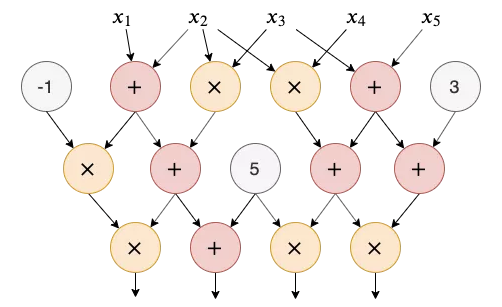
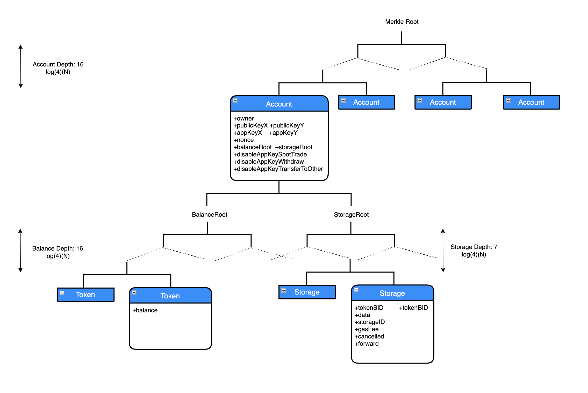
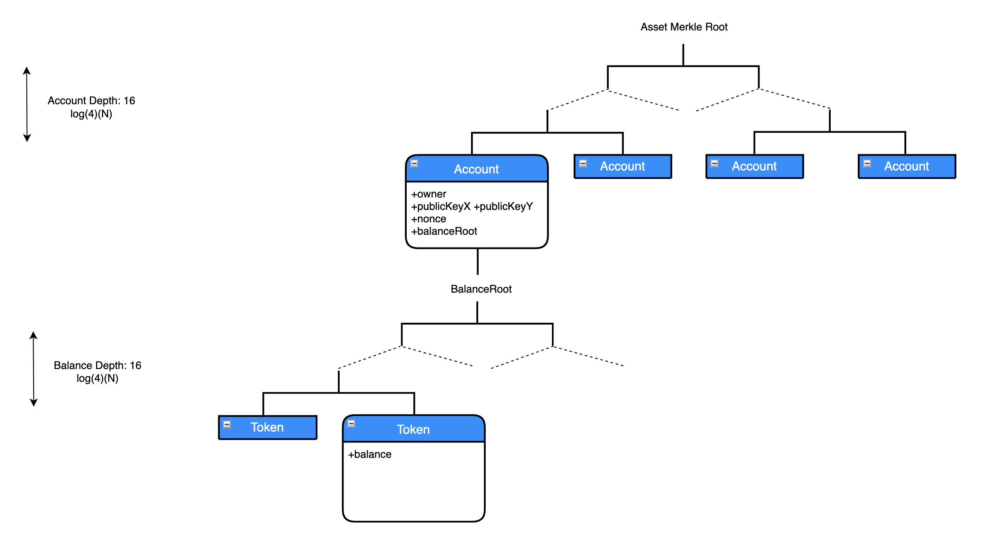

# Circuit Design

# Glossary
| Terms |      Description        |
| :--------:|:-------------------|
|Layer 1 (L1)	|Layer 1 refers to a base blockchain network/protocol that validates and finalizes transactions.	|
|Layer 2 (L2)	|Layer 2 refers to scaling solutions for the blockchain layer 1 network that handles transactions off the layer 1 network and at the same time, benefits from layer 1 security, data availability, and decentralization.	|
|Asset Merkle Tree	|The asset Merkle tree is a Merkle tree that stores all important data of DeGate's accounts and assets.	|
|Entire Merkle Tree|The entire Merkle tree is a Merkle tree that stores all data of DeGate's accounts, assets, and orders.	|
|Zero Knowledge Proof	|A zero-knowledge proof is a way of proving the validity of a statement without revealing the statement itself.	|
|zkSNARK|zk-SNARK refers to a proof architecture where one can demonstrate ownership of specific knowledge, such as a secret key, without disclosing that knowledge and without interacting with either the prover or the verifier.	|
|ZK-Rollup|Zero-knowledge rollup is a layer 2 scaling solution that bundles transactions into batches that are executed off-chain where the summary of the change representing all the batched transactions is submitted into the blockchain. This increase throughput on the blockchain network by moving computation and state-storage off-chain.	|
|DeGate Account	|DeGate account is used to track portfolio assets, place orders, facilitate deposits, withdrawals, and transfers in DeGate protocol.	|
|Exodus Mode	|Exodus mode allows users to retrieve assets in their DeGate account without the involvement of any third party. When the exodus mode is activated, DeGate smart contract rejects receiving new zkBlock data (all off-chain activities will cease). DeGate protocol will only support the withdrawal of user assets back to their wallet address.	|
|Force Withdrawal	|Force withdrawal is a smart contract function that allows users to initiate a withdrawal request that forces DeGate node(s) to execute the request within a stipulated timeframe.|
|Shutdown Mode	|Shutdown mode can be activated by the DeGate protocol which returns all assets to users.	|
|ZKP-Worker|ZKP-Worker generates zero-knowledge proofs through the circuit based on the data passed by the operator.	|
|Key Pair	|In asymmetric encryption, a key pair refers to a private key and a public key which is generated from the private key.	|
|Asset Key Pair	|An asset key pair is an authorization key to perform transactions (e.g. placing orders, order cancellations, withdrawals, transfers) on the DeGate Protocol. It is generated from the wallet's ECDSA signature, is temporarily stored in the local browser, and will be removed when all the browser sessions running DeGate Protocol are terminated. When a DeGate account is upgraded to become an advanced user, the asset keypair is no longer stored in the local browser.|
|Asset Private Key	|Asset private key refers to the private key in the asset key pair.	|
|Asset Public Key	|Asset public key refers to the public key in the asset key pair.	|
|Trading Key Pair	|A trading keypair is generated once a DeGate account is upgraded to an advanced user. It has trading permissions to place orders, create grid strategies, cancel orders, and cancel grid strategies. The wallet’s ECDSA signature generates the trading keypair and stores it in the local browser.	|
|Trading Private Key	|Trading private key refers to the private key in the trading key pair.	|
|Trading Public Key	|Trading public key refers to the public in the trading key pair.	|
|Advanced Deposit	|Users utilize the Deposit function in DeGate's smart contract to perform asset deposits.	|
|Standard Deposit	|Users perform asset deposits by transferring their assets directly to DeGate's smart contract address.	|
|Gas Fee	|Gas fee is the amount of computational effort gas, required to execute operations on the Ethereum network. In the current phase of the DeGate protocol, ETH, USDC & USDT can be used to pay for the gas fee.	|
|Trading Fee	|A trading fee is charged each time a trade occurs and is fully paid by the taker order. An order can be charged multiple trading fees if it matches with multiple orders. Trading fee is the main source of revenue for the DeGate protocol.	|
|Order|An order is an instruction to buy or sell a token. Each order can be matched with one or more orders or even none. A trade occurs whenever an order is matched with another order. Note: an order can be a maker/taker/maker & taker.	|
|Order Expiration	|Order expiration restricts the activeness of a limit or grid order. An unfilled and active order will automatically be canceled (removed from the order book) after the order expiration time.	|
|Trade|A trade occurs when two orders (a maker & a taker order) are matched by the trading system.	|
|Taker|Taker is a characteristic of order – the portion of an order that is instantly matched (before going on the order book) with other order(s) in the order book.|
|Maker|Maker is a characteristic of order – the portion of an order that is not instantly matched (going on the order book) after order placement.|
|Grid Strategy	|Grid Strategy is a quantitative trading strategy that helps users automatically execute a series of buy low and sell high orders within the price range based on the defined grid interval.	|
|Grid Order	|Grid Order is an order placed at a stipulated grid level based on the grid strategy's parameters. It can be both a buy/sell order depending on how current market price and how it fluctuates in the grid strategy price interval.	|
|On-chain Order Cancellation	|On-chain order cancellation is a feature that is designed to increase trustlessness in the DeGate protocol. It submits the order cancellation instruction for canceled order that has an active order validity period to the blockchain which ensures the order can never be executed again.	|

## Introduction
The circuit of Zero Knowledge Proof is not an engineering electronic circuit, but a logical circuit that consists of several logic gates. 


Any calculation can be described as an arithmetic circuit. Based on this premise, Complex logical operations can be disassembled and described in terms of simple addition and multiplication gates eventually.

DeGate uses the Groth16 algorithm of zk-SNARKs (Zero-Knowledge Succinct Non-interactive Arguments of Knowledge) protocol to implement zero knowledge proofs. The Groth16 algorithm requires developers to implement the R1CS (Rank-1 Constraint System) circuit.

R1CS contains a sequence made of three vectors (a, b, c), and a solution vector s that must satisfy the constraint: < $\vec{s}$ , $\vec{a}$ > · <$\vec{s}$ , $\vec{b}$ > - < $\vec{s}$ , $\vec{c}$ > = 0 , where "・" denotes the inner product operation of the vectors.

In the proving steps of the zk-SNARKs protocol, the construction of R1CS is directly related to the problem to be proved.  The kind and size of the problem directly determine the size of the R1CS circuit, i.e., the number of constraints.


## Circuit Constraint
DeGate uses the Groth16 algorithm to implement zero knowledge proofs.

Groth16 uses FFT (Fast Fourier Transformation) operations to optimize the efficiency of polynomial computation.
The range of values of FFT is different for different curves, but all need to find two values on the prime domain of the curve that satisfies:
2^s * t = module - 1, where t is an odd number and 2^s is the range of values of the group for FFT. see [libfqfft doc](https://github.com/scipr-lab/libfqfft/blob/master/README.md#background) for more details.

Groth16 uses the ALT_BN128 curve. For the ALT_BN128 curve, s = 28, so the FFT takes the value range (0, 2^28), which is the range of the number of constraints of the R1CS circuit.

### ALT_BN128 Curve
ALT_BN128 is a known elliptic curve.  Pre-compiled contracts for this curve have been added to Ethereum in EIP196 and EIP197, which makes it possible to save more gas by using this curve for on-chain calculations. 

### zkBlock Size
As you can see from the DeGate design documentation, DeGate bundles off-chain transactions into zkBlock and submits the zkBlock to the blockchain.

Due to the specificity of the circuit, the number of constraints must be a definite value so it is not allowed to dynamically modify the number of transactions in the zkBlock. Therefore DeGate will identify several zkBlocks sizes with specific numbers of transactions before being deployed to the mainet.

 A more intuitive way to put it is that there are different sets of PKs (proving key, as defined in the zk-SNARKs protocol description) and VKs (verifying key).  These pairs of PKs and VKs correspond to different numbers of transactions in the zkBlock.

The larger the number of transactions in zkBlock, the more cumbersome to describe the problem, and the larger the volume of the R1CS circuit constraints. The number of constraints cannot be infinitely large due to the limitation of the ALT_BN128 curve, i.e., the number of transactions cannot be infinite.

According to the  FFT range formula, different s values determine a different value range, and different value range determines the difficulty of FFT calculation, i.e. the amount of CPU and memory usage. So how to determine the appropriate number of transactions depends on whether the total number of constraints of zkBlock reaches the limit value of 2^s.

Currently, zkBlocks produced by DeGate have the following sizes: 355, 300, 250, 200, 150, 100, 50, 25, 10, 5.


# Data Storage
## Merkle Tree
After much research and trsting, it was found that the merkle tree (aka Hash tree) structure is most suitable for decentralized exchanges which are based on zero knowledge proofs. The account data, asset data, and transaction data of all users are stored in the leaf nodes of the merkle tree (off-chain). Only the root hash of the tree is recorded on the chain. It can greatly reduce the cost of publishing to the chain.

It needs to modify the information of the relevant user account in the tree off-chain when committing the zkBlock, while only the root hash on the chain needs to be updated. Of course, all of this will happen after a successful zero knowledge proof verification.


## Quadtree
DeGate takes [PoseidonHash](#poseidon-signature) to calculate the tree node hash. Since it is more efficient to calculate hash using PoseidonHash by 4 inputs than other numbers of inputs, DeGate chooses a quadtree tree to build the merkle tree structure.

## Two Trees
DeGate has designed two trees to store the information of user accounts, assets, and orders, one is the Entire Merkle Tree and the other is the Asset Merkle Tree.

The Entire Merkle Tree and the Asset Merkle Tree have different duties:

- Entire Merkle Tree ensures data security on DeGate decentralized exchanges.
- The Asset Merkle Tree ensures that users' assets are in self-custody so that even if DeGate is unable to provide any service, users can still safely withdraw their assets, please refer to the [Exodus Mode Implementation](./DeGate%20Protocol%20Specification%20Document.md#exodus-mode) document.


### Entire Merkle Tree

As shown in the graph, the Entire Merkle Tree consists of three quadtrees, namely the Account Tree, Balance Subtree and Storage Subtree. The root of the Entire Merkle Tree is a 16-level Account Tree with 4^16 leaf nodes which are called Account Nodes by DeGate. Each Account node has an exclusive 16-level Balance Subtree and a 7-level Storage Subtree.

After much research, DeGate determined the size of the three trees based on factors such as security, usability, and economics.

The leaf node index numbers of the account tree and balance tree are the DeGate account ID and TokenID respectively.

DeGate does not have to store all trading history information in the tree, so only seven layers were designed for both usability and economy.


#### Node Information Description
##### Balance Tree
The balance tree has 4^16 token nodes, each node records the balance of the token.
```
balance:  the balance of the token, the default value is 0. The tokenID of the token is the index of the leaf node of the balance tree, and it starts from 0.
```

##### Storage Tree
The storage tree has 4^7 storage nodes, each node records the information of each trade.

```
storageID: self-incrementing ID, refer to storageID details, the default value is 0.

tokenSID: There are multiple meanings, refer to tokenSID for details, the default value is 0.

tokenBID: There are multiple meanings, refer to 
tokenBID for details, the default value is 0.

data:  There are multiple meanings, refer to data for details, the default value is 0.

gasFee: Only for spot transactions, record the cumulative consumption of gas fee for the order, the default value is 0.

cancelled: Mark whether the order is cancelled or not, the default value is 0, 0: not cancelled, 1: cancelled.

forward: Only used for grid order, mark whether the order is a positive order, the default value is 1, 0: reverse order, 1: positive order.
```
###### StorageID Specification

1. The maximum value of storageID is 2^32, while the storage tree is a 7-level 4-ary tree whose total number of leaf nodes is only 4^7 = 2^14 that is much smaller than the maximum value of storageID, so when the storageID of an order > 4^7, the storage will be overwritten from the node at position 0, which is described mathematically as storage node number = storageID of a trading % 4^7.
2. The storageID needs to meet the special requirement of monotonically increasing, which can prevent the transaction from being replayed.

###### TokenSID Specification
1. Record the sell token ID in the spot trading transaction.
2. Record the transfer token ID in the transfer transaction.
3. Record the withdrawal token ID in the withdrawal transaction.

###### TokenBID Specification
1. Record the buy token ID in the spot trading transaction.
2. Set to 0 in transfer transactions.
3. Set to 0 in withdrawal transactions.

###### Data Specification
1. Record the amount of tokens that have been matched in the spot trading transaction. 
2. Used in transfer transactions to prevent replay, the value needs to be changed from 0 to 1.
3. Used in withdrawal transactions to prevent replay, the value needs to be changed from 0 to 1.

##### The Account Tree
The Account Tree has 4^16 account nodes, where each node records a user's account information, including asset public key, trading public key, balance tree root hash, storage tree root hash, etc.

```
owner: The wallet address in decimal format, which corresponds to the wallet private key that has absolute control over the address. It can be updated via DeGate for all fields except the owner. The default value is 0. 

publicKeyX: Asset public key X value, EdDSA format, the public key is a point on the elliptic curve, can be represented by (X, Y), the default value is 0.

publicKeyY: Asset public key Y value, EdDSA format, the default value is 0.

appKeyX: Transaction public key X value, EdDSA formate, the default value is 0.

appKeyY: Transaction public key Y value, EdDSA formate, the default value is 0.

nonce: The cumulative value of AccountUpdate, AppKeyUpdate transaction, each call automatically adds 1, anti-replay. Starts counting from 0, the default value is 0.

disableAppKeySpotTrade: Whether to enable the spot transaction function of the trading private key, the default value is 0, 0: enable, 1:disable.

disableAppKeyWithdraw: Whether to enable the withdrawal function of the app key, the default value is 0, 0: enable, 1: disable.

disableAppKeyTransferToOther: Whether to enable the transfer function of the app key, the default value is 0, 0: enable, 1: disable.

balanceRoot: The root hash of the Balance Tree， the default value is 3626386379762139238426088069940068312069344602207393459612601721558984385997（all leaf nodes are default values ）

storageRoot: the root hash of the Storage Tree, the default value is 17168846436385410234776549269474130900971613041027057153527920776001261983060（all leaf nodes are default values）
```
### Asset Merkle Tree


The Account Subtree of the Asset Merkle Tree is different from the Account Subtree of the Entire tree. The data of their leaf nodes are not the same. DeGate refers to the Account Subtree of the Asset Merkle Tree as the Abbreviated Account Tree.

As can be seen from the graph,  The Asset Merkle Tree consists of two 4-ary merkle trees, namely Abbreviated Account Tree, and Balance Subtree. At the top of the Asset Tree, there is a 16-level  Abbreviated Account Tree with 4^16 leaf nodes called the Abbreviated Account Nodes. Each Abbreviated Account Node has an exclusive 16-level balance subtree.


#### Abbreviated Account Tree
The Abbreviated Account Tree contains the wallet address, asset public key, nonce, and balance subtree root Hash. Compared to the account subtree of The Entire Tree, it excludes the permission setting fields for trading public key and trading private key.

#### Differences Between The Asset Tree And The Entire Tree


|   Similarities    |            Differences                 |
| :----------:|:---------------------------------:|
|1. The fields the Asset Tree contained are included in the Entire Tree. The Asset Tree can be considered as an abstract of the Entire tree. <br/> 2. If the fields in the Asset Tree change, the Entire tree needs to be changed too.|  1. The Asset Tree has no subtree of storage tree and its leaf nodes contain only the core fields related to the assets.<br/>  2. Changes in the Asset Tree need to be published to the blockchain via Calldata. While transaction informations of the Entire Tree does not need to be published to the blockchain.   |


#### Node Information Description
##### The Balance Tree

The Balance Tree has 4^16 token nodes, each node records the balance of the token.

```
balance:  balance of the token, and the default value is 0. The tokenID of the token is the index of the leaf node of the Balance Tree, and it starts from 0.
```
##### Abbreviated Account Tree
The Abbreviated Account Tree has 4^16 account leaf nodes, each node records a user's account information, including asset public key, balance tree root hash, etc.

```
owner: The wallet address in decimal format, which corresponds to the wallet private key that has absolute control over the address. It can be updated via DeGate for all fields except the owner. The default value is 0 

publicKeyX: Asset public key X value, EdDSA format, the public key is a point on the elliptic curve, can be represented by (X, Y), the default value is 0

publicKeyY: Asset public key Y value, EdDSA format, the default value is 0

nonce: The cumulative value of AccountUpdate, AppKeyUpdate transaction, each call automatically adds 1, anti-replay. Starts counting from 0, the default value is 0

balanceRoot:  the root hash of the Balance Tree, the default value is 3626386379762139238426088069940068312069344602207393459612601721558984385997（all  leaf nodes are default values ）

```

# zkBlock
## zkBlock Structure
zkBlock contains four major parts: transaction information, state change information, block producer information, and block attributes.

### Transaction Information
Transactions are classified into different types, each having different functionalities, such as account updates, deposit, withdrawal, etc. All of the transactions will be packaged in one zkBlock.

The transactions will contain all abstract information related to the type of transaction, as described in the [ZK-Rollup transaction](#zk-rollup-transaction) section.


### Operator
The block producer is called the Operator in DeGate.
When Operator is initialized, DeGate assigns a DeGate-controlled L2 account to the operator as the operator account. When committing blocks, the operator will use the asset private key to sign the zkBlock data, and then the data will be verified by the circuit.
For each new zkBlock, the nonce of the operator's Account Tree node needs to be cumulatively added by 1 for replay prevention.


### Block
zkBlock contains a number of attribute values as below: 
* timestamp: The circuit is just an executable program and does not contain a timestamp. It needs to rely on external time input. See more detail in [Timestamp](#timestamp).
* protocolFeeBips: Maximum percentage of protocol fee, Operator will do the consistency check between the protocolFeeBips in zkBlock and the protocolFeeBips in the contract when producing the ZKBlock, refer to the contract design document protocolFeeBips for details.
* blockSize: Number of transactions contained in one zkBlock.
* merkleRootBefore, merkleRootAfter: The Entire Tree root hash before and after zkBlock producing.
* merkleAssetRootBefore, merkleAssetRootAfter: The Asset Tree root hash before and after zkBlock producing.

***Other attribute values reference*** [Smart Contract Design Doc](./Smart%20Contract%20Design.md#zkblock-data-definition)

## zkBlock Data Validation

ZKP-Worker is an execution program that receives zkBlock as input data and performs an accuracy check on the input data before generating the zero knowledge proof. These checks prevent inconsistencies that could lead to irreversible errors. 

The check steps are as following: 

1. Parse the zkBlock information.
2. Iterate through all the transactions contained in the zkBlock, and calculate the current state information and the root hash of the two trees according to the transactions provided by the zkBlock and the previous state information. If the calculated root hash of the trees is not the same as the root hash of the tree provided by the zkBlock, the program will be interrupted and an exception will be thrown. 
3. Execute signature verification for the transactions which require this. Once the signature verification fails, the program will be interrupted and an exception will be thrown.
4. Calculate the state change of the Operator account and compare the hashes. The circuit will interrupt the program and throw an exception in case of inconsistency.
5. Perform a signature check on all the data of zkBlock, once the signature check fails, The circuit will interrupt and throw an exception.

## Input Parameters For Zero Knowledge Proof Verification

There is only one input parameter called `publicInputDataHash` for Zero Knowledge proof verification

### PublicInputData
Zero Knowledge Proof Verification uses original data from zkBlock to verify the `publicInputDataHash`, including  Calldata, attributes and merkleRoot.

### PublicInputData Structure：
```
address exchange;
bytes32 merkleRootBefore;
bytes32 merkleRootAfter;
bytes32 merkleAssetRootBefore;
bytes32 merkleAssetRootAfter;
uint32  timestamp;
uint8   protocolFeeBips;
uint32  numConditionalTransactions;
uint32  operatorAccountID;
uint16  depositSize;
uint16  accountUpdateSize;
uint16  withdrawSize;

PublicInputData of all transactions packed together in order of the timestamp.
```
### 83Bytes
The maximum fillable data of PublicInputData for each transaction is 83bytes, and those less than 83bytes are filled with 0 bytes starting from the end. That is, once the size of zkBlock is fixed, the length of publicInputData of all transactions and zkBlock are determined.

### PublicInputDataHash
The PublicInputDataHash consists of the first 253 bits of the PublicInputData after the data is hashed by the sha256 algorithm. The main reason for taking 253 bits is that the finite fields of BN128 curve is less than 2^254, and larger than 2^253.


## ZK-Rollup Transaction
### Noop
The empty transaction. 

#### Function Description
From [zkBlockSize](#zkblock-size), the number of transactions zkBlock can support is fixed. The following options are available (355, 300, 250, 200, 150, 100, 50, 25, 10, 5).

DeGate needs to ensure that transactions sent by users are posted to the blockchain within a certain time. When the number of transactions within a certain time does not meet the fixed blocksize number of zkBlocks and there are no Noop transactions, a lower magnitude blocksize will be selected for packing. So all transactions accumulated within a certain time will be split into many zkBlocks for submission to the blockchain. 
In terms of gas cost, the approach is extremely unreasonable in most cases. While if there are Noop transactions, another option exists for DeGate. When the number of transactions is less than the fixed number of zkBlocks in a certain time, it uses the meaningless Noop transactions to fill the block to meet the block size requirement. In this way, it can use only one block to achieve the same effect as the previous several zkBlocks.


#### PublicInputData
```
=> 0 bytes/noop
=> PublicInputData cost: 0 * 16 = 0 gas/noop
```

### Transfer
#### Function Description
Transfer Transaction, which allows two DeGate accounts to complete an asset transfer by paying a certain gas fee.

#### Transfer Registration
DeGate allows transferring funds to accounts that are not registered in DeGate. In the transaction, it needs to specify "toAccountID" as 0. When the transfer is being processed, DeGate assigns an account ID to the unregistered account and completes the registration. It is the act of binding the account ID to the wallet address.

After that, unregistered users only need to set the asset public key when logging DeGate and can normally use any functions of DeGate Exchange.

The registration behavior is triggered by the sender, so the gas fee for the registered account is paid by the sender.

#### PoseidonHash Fields Description
```
Transfer {
  exchange (160bit)  Exchange Unique Identification ID
  fromAccountID (32bit)  sender accountID
  toAccountID (32bit)  receiver accountID
  tokenID (32bit)  TokenID
  amount (96bit)  Token amount
  feeTokenID (32bit)  fee token ID
  maxFee (96bit)  Maximum cost of gas fee Token 
  to (160bit)    decimal format, the receiver's wallet address 
  dualAuthorX (254bit)  Authorized transfer, authorized public key X-coordinate, DeGate is not yet open for this feature, value is 0
  dualAuthorY (254bit)  Authorized transfer, authorized public key Y-coordinate, DeGate is not yet open for this feature, value is 0
  validUntil (32bit)  Validity period of the transfer transaction signature
  storageID (32bit)  The storage location of the transfer transaction
  useAppKey (1bit)  Whether the transfer uses the asset private key to sign, 0: use the asset private key to sign; 1: use the asset private key to  sign
}
```
The hash algorithm used for transaction signatures [Poseidon/t14f6p53](#poseidon-signature). The input parameters are the data above.

#### Replay Prevention
Transaction replay must be prohibited.
After the transfer is completed, the value of the "data" field in the "storageID" is set to 1. When the transfer transaction is replayed and the circuit find that the "storageID" of the transaction is the same as the "storageID" of its corresponding storage area, but the value of the "data" field is not 0, the circuit program will directly interrupt and throws an exception.


#### Gas Fee Description
The gas fee can be paid by the sender in any token in any amount, but in the Front-end, there is a limitation on token type and token amount that can be charged as gas fee. For the transacton, the operator can decide whether bundle it or not.

When a transfer transaction triggers the account registration, the sender pays the registration fee, which is determined by DeGate based on the real-time mainnet gas fee. The DeGate front-end interface will specify some of the commonly used tokens as gas fee tokens.

#### PublicInputData Fields
```
- Type Tx: 3 bits  transaction type, Transfer transaction is 1
- Type Tx Pad: 1 bit  0bit fill, meaningless
- Type: 1 byte (must be 0)  transaction type, constant to 0
- From account ID: 4 bytes  sender account ID
- To account ID: 4 bytes  receiver account ID
- Token ID: 4 bytes  transfer TokenID
- Amount: 4 bytes （32 bits, 25 bits for the mantissa part and 7 for the exponent part)  Amount of transfer token, expressed in scientific notation, with 7 valid digits
- Fee token ID: 4 bytes  gas fee token ID
- Fee amount: 2 bytes （16 bits, 11 bits for the mantissa part and 5 for the exponent part)  Amount of gas fee token, expressed in scientific notation, with 3 valid digits
- StorageID: 4 bytes
- To: 20 bytes （only set when transferring to a new account)  sender address, shouldn't be null 
- From: 20 bytes  sender address, Constantly to 0 for now
=> 27.5 bytes/transfer (in the most common case)
=> PublicInputData cost(Ignore 0byte consumption): 27.5 * 16 = 440 gas/transfer
```


### SpotTrade
#### Function Description
Spot Trading.
SpotTrade allows two orders to be matched off-chain, and balance changes of the matched assets are included in PublicInputData which will be posted to the blockchain.

```
Order {
  exchange (160bit)  Exchange Unique Identification ID
  storageID (32bit)  storage ID
  accountID (32bit)  maker account ID
  tokenS (32bit)  Selling token ID
  tokenB (32bit)  Buying token ID
  amountS (96bit)  Selling token amount
  amountB (96bit)  Buying token amount
  validUntil (32bit)  Validity period of the order
  fillAmountBorS (1bit)  Specify one token and record the amount of this token. When the amount of this token reaches the amount specified in the order, it is used as the basis for the completion of the current order. See the description below for details: Order Filled. 
  taker (160bit)   Specify a user address, orders can only be matched with the user corresponding to the address, see the description below: Specify the taker
  feeTokenID (32bit)   Gas fee token ID
  maxFee (96bit)  The maximum cost of the gas fee
  feeBips（12bit）Trading fee ratio，actual trading fee ratio=feeBips/10000
  type (8bit) Order type, see description below for details: Order Type
  gridOffset (96bit)  Properties of the grid strategy, arithmetic grid quantity difference
  orderOffset (96bit)  Properties of grid strategy, reverse order quantity difference 
  maxLevel (8bit)  Properties of grid strategy, grid level, counting from 0, number of grids = grid level + 1
  useAppKey (1bit)  Whether the order is signed by the transaction private key, 0: Signed with the asset private key; 1: Signed with the transaction private key
}
```
The hash algorithm of the order signature uses [Poseidon/t19f6p53](#poseidon-signature). The above data are the input parameters. The signature is signed by the order creator, using his asset private key or trading private key.


#### Trading Data Description
```
SpotTrade {
  Order orderA  taker order
  Order orderB  maker order
  orderA_fillS （32 bits, 25 bits for the mantissa part and 7 for the exponent part) The amount of sold token by the taker, expressed in scientific notation, with a total length of 32bits, 25bits for the number of valid bits and 7bits for the index size
  orderB_fillS （32 bits, 25 bits for the mantissa part and 7 for the exponent part) The number of the sold token by the maker, expressed in scientific notation, with a total length of 32bits, 25bits for the number of valid bits and 7bits for the index size
}
```
SpotTrade: Spot Trading occurs between two orders from two users. The amount of selling tokens of user A should be the same as the amount of buying tokens of user B without trading fees and gas fee, and vice versa.

#### Order Types
DeGate supports three order types.
* type=0, general orders, limit orders, and market orders are general orders
* type=6, grid order, and direction is selling
* type=7, grid order, and direction is buying

#### Specify Counterpart
DeGate supports the function that users can specify the counterpart, allowing users to sell assets to other specified users at a certain price.

#### Order Filled
Orders contain both the amount of selling tokens and the buying tokens. In a real match scenario, it is hard to match the buying token amount with the selling token amount in only one transaction. It is necessary to explicitly specify the token to be matched. When the token amount matched reaches the amount of order signatures, we consider this order to have been filled.

DeGate uses the "fillAmountBorS" to specify the token to buy or sell. A field value of 1 mark as a buy token and a field value of 0 marks as a sell token.


#### Order Partially Filled
SpotTrade supports partial trading. The filled amount is recorded in the "data" field of the Entire Tree's storage subtree. So that the user does not need to sign again for the subsequent trading, but simply accumulates the newly filled amount on the original filled record. 
The circuit will ensure that the total filled amount is not greater than the amount the order signed.

Only the token marked by the "fillAmountBorS" will be recorded in the storage subtree.


#### Replay Prevention
SpotTrade must prevent replay.

##### Prevention Replay Of Filled Amount
The "fillAmountBorS" field of the subtree records the filled amount. It is located in the "data" field.
The circuit interrupts proof generation and throws an exception when the total filled amount recorded is greater than the amount that the order signed.

##### Prevention Replay Of Gas Fee：
The "gasFee" field of the storage subtree records the gas fee cost of each trading. 
The circuit interrupts proof generation and throws an exception when the total gas fee amount recorded is greater than the amount that the order signed.


####  Deviation Of Fill Price 
DeGate allows orders to be filled within a range of price fluctuations (thousandths of a percent).

The one-thousandth deviation is a loss limitation for the user, i.e. having a higher/lower price for buying/selling a specific token where the price can cause a huge loss. But DeGate does not restrict the user from having a match with other users at a better or even very good price, i.e. the user can spend less to get the desired token amount.

The formula is: (fillAmountS/fillAmountB)/(amountS/amountB) <= 1.001, where fillAmountS is the filled amount of the selling token, fillAmountB is the filled amount of buying token, amountS is the amount user signed to sell, and amountB is the amount user signed to buy.


#### TradingFee Description
DeGate charges a fixed amount of trading fee for orders.

##### TradingFee Token
The token to be charged must be the buying token of the order.

##### FeeBips
Different fee rates will apply to different pairs, but cannot exceed the maximum rate  "protocolFeeBips" set in the contract, see [Description of the maximum trading fee rate](https://docs.degate.com/v/product_en/concepts/protocol-fees).

Once the maximum contract-set rate is exceeded, zkBlock will not be posted to the blockchain.
The maximum rate is used to protect the user, and the contract can change the maximum rate, but each change takes 7 days to take effect.

##### Calculation Formula
Formula: tradingFee = the amount of buying token * feeBips / 10000, where feeBips is a positive integer.

The actual fee charged is determined by DeGate, but it must follow the rule: 
the designated fee <= the calculated fee.

##### Difference Between the Tradingfee of Maker and Taker
In the circuit, there is no distinction between the maker and the taker.
The contract and circuit allows a reasonable trading fee. However, DeGate has the authority to charge a lesser amount or no trading fee, depending on [DeGate's strategy](https://docs.degate.com/v/product_en/concepts/protocol-fees#gas-fee-computation).

#### Gasfee Description
DeGate charges a fixed amount of gas fee for orders.

##### Gasfee Token
The token to be charged must be the tokens of the order.

##### Gasfee Amount
DeGate calculates gas fee based on real-time on-chain costs.

##### The Maximum Of The Gas Fee
The gas fee charged by DeGate should not exceed the maximum gas fee set by the user's signature.

DeGate supports partial filled orders and charges a gas fee for each match. The total gas fee for all transactions can not exceed the maximum gas fee set by the user's signature.


#### Difference Between The Gasfee Of Maker And Taker 
In the circuit, there is no distinction between the maker and the taker.
It is allowed to charge a reasonable amount of gas fee in the contract and circuit. However, DeGate has the authority to charge less or no gas fee, depending on DeGate's strategy.


#### The Maximum Amount Of Order
Each order is bound with a "storageID". As seen from the data storage instructions, the maximum "storageID" is 2^32, so a DeGate account can only sign a maximum of 2^32 orders at any one time.
Unmatched orders can be reused when their storageID expires.
 
### Grid Order
DeGate supports users to sign decentralized grid strategies to earn more profits through grid trading.

#### Grid Overview
DeGate's grid is similar to the grid of centralized exchanges. The main difference is in degree of centralization.

The grid allows users to deploy multiple orders in an arithmetic manner. When one order is matched, a reserve order is immediately deployed at a favorable price (if the buy order is matched, a sell order is immediately deployed and vice versa). As the price of the trading pair fluctuates within the grid range, the deployment of reverse orders is triggered frequently, allowing for profit.

DeGate only supports the different levels of grid order by modifying the quote token. That means, when users use grid strategy for a different level of grid order, they can only modify the amount of quote token while fixing the amount of base token.

#### Grid Terms
```
Arithmetic Grid: Fixing the selling (or buying) token amount while modifying buying (or selling) token amount, will generate different levels of grid order to deploy.

Spread: The gap between the adjacent level of the grid order.

Reverse Order: A reverse order is the opposite of the usual order. After exchanging tokens in the usual order, the user act in the opposite way. eg: usual order: buy 1 A token at a lower price; reverse order: sell 1 A token at a higher price

Reverse Order Quantity Difference: It refers to the difference in the number of reverse orders that are being placed in the market.

Grid Level: Starting from 0 to maxLevel. The arithmetic Grid is constructed from grid level 0 to maxLevel.
```

#### Grid Type
Grid is divided into two types, buying order strategy and selling order strategy. The main difference between them is the calculation in the circuit, see [Calculation Rules](#grid-selling-order-strategy-calculation-rules) for more details.

The grid type is transparent to the users:

- When the grid order is in the buying order area, DeGate uses the buying order strategy.
- When the grid order is in the selling order area, DeGate uses the selling order strategy.
- When the grid order covers both the buying and selling areas, it is automatically split into buying and selling order strategies.

#### Grid Signature
Users don't have to sign every grid order, instead, users only need to sign the grid strategy for once. When grid order cover buying and selling areas, it requires users to sign twice, as there are two strategies, the buying, and selling strategies.

The following are four key pieces of information in the grid signature:
```
type (8bit):  Order Type
gridOffset (96bit):  Properties of the grid strategy, spread
orderOffset (96bit):  Properties of grid strategy, gap amount Of reverse order
maxLevel (8bit):  Properties of grid strategy, grid Level, counting from 0, number of grids = grid level + 1
```

#### Grid Implementation
Each grid order requires users' signed order info which is called "startOrder" and will pass it to the circuit for signature verification.

Grid order is calculated & provided by DeGate according to grid strategy rules. After the circuit receives the grid order and startOrder, it verifies the signature of startOrder first. If the verification passed, it calculates the grid order itself with the grid strategy rules, then compares it with the one given by DeGate. If the comparison is failed, the circuit is interrupted immediately and throws an exception.

For the same grid order, all forward and reverse orders share the same "storageID", which means they are sharing the same storage area. When reverse order occurs after the forward order summary is completed,  If it is a reverse order, the "data" & "forward" fields in the storage area are set to 0, and the trading quantity counted from 0, and vice versa.


#### Grid Order StorageID
For grid order with different grid levels, here is the rule for the storageID of different grid level:
level(n).storageID = startOrder.storageID + n.

This rule is used to fix the storage area for each grid level, in case DeGate provides a random storageID, which may cause storage data to be abnormal.

#### Grid Selling Order Strategy Calculation Rules
For the grid selling order strategy signature, the "type" field is 6. Let's take tokenS as the base token and tokenB as the quote token for example. For a grid strategy with different levels, fixing amountS, modifying amountB. The greater the level, the more amountB will get by selling fixed amountS.

Take maxLevel=4 as an example, the maximum price inputted by users is: 
price = quote/base

|   Level    |            amount                 |
| :----------:|:---------------------------------:|
|  Level=4   |     quote, base                   |
|  Level=3   |     quote - gridOffset, base      |
|  Level=2   |     quote - 2*gridOffset, base    |
|  Level=1   |     quote - 3*gridOffset, base    |
|  Level=0   |     quote - 4*gridOffset, base    |

For these orders, users only need to sign the order with Level=0. 

#### Grid Buying Order Strategy Calculation Rules
For the grid buying order strategy signature, the "type" field is 7. Let's take tokenS as quote token, tokenB as base token for example. For a grid strategy with different levels, fixing amountB, modifying amountS. The greater the level, the less amountS will cost for buying fixed amountB.

Take maxLevel=4 as an example, the minimum price inputted by users is: 
price = quote/base 

|   Level    |            amount                 |
| :----------:|:---------------------------------:|
|  Level=0   |     quote + 4*gridOffset, base    |
|  Level=1   |     quote + 3*gridOffset, base    |
|  Level=2   |     quote + 2*gridOffset, base    |
|  Level=3   |     quote + gridOffset, base      |
|  Level=4   |     quote, base                   |


For these orders, users only need to sign the order with Level=0. 

#### Grid Selling Reverse Order Calculation Rules
For the grid selling reverse order signatures, the "type" field value is the same as the selling order strategy. Here, let's suppose the following:
1) TokenS is the base token.
2) TokenB is the quote token.
3) Forward order is a selling order.
4) Reverse order is buying order.
5) Fixing amountS.

it will be: 

- Forward Order fillAmountBorS=false.
- Reverse Order fillAmountBorS=true.

Order chain example, the initial order for the order chain is:
amountS = X，amountB = Y

| Sequence |        amountS      |        amountB       |
| :--------:|:-------------------:|:--------------------:|
|    0     |           X         |           y          |
|    1     |    Y - orderOffset  |           X          |
|    2     |           X         |           y          |

#### Grid Buying Order Reverse Order Calculation Rules
For buying reverse order signature, the "type" field value is the same as buying order strategy.
Here, let's suppose the following:
1) TokenS is the quote token.
2) TokenB is the base token.
3) Forward order is a buy order.
4) Reverse order is a sell order.
5) Fixing amountB.

it will be:

- Forward Order fillAmountBorS=true.
- Reverse Order fillAmountBorS=false.

Order chain example, the initial order for the order chain is:
amountS = X，amountB = Y

| Sequence |        amountS      |        amountB       |
| :--------:|:-------------------:|:--------------------:|
|    0     |           X         |           y          |
|    1     |           Y         |   X + orderOffset    |
|    2     |           X         |           y          |


#### Grid Order Cancellation
DeGate offers the cancellation of both off-chain and on-chain grid order. The cancellation of off-chain grid order is similar to off-chain order cancellation, in which DeGate discards the user's grid order. In this case, users need to trust DeGate for this operation.

The cancellation of on-chain grid order does not finish in a single transaction, it involves the users initiating ("maxLevel" + 1) OrderCancel transactions. The reason is that different grid level of grid order have their storage area, and the OrderCancel transaction will set the "canceled" field of the storage area to 1. So it is necessary to set the "canceled" field one by one for grid order with different levels. 

#### Grid Order Validity Period
All orders within the same grid order strategy share the same validity period. As it is the validity period that users signed at the start of the strategy.

#### PublicInputData Definition
```
- txType: 3bits Trade Type; For SpotTrade it is 2
- txTypePad: 1bits  Filling with 0 is meaningless
- For both Orders:
    - Account ID: 4 bytes
    - TokenS: 4 bytes
    - FillS: 4 bytes （32 bits, 25 bits for the mantissa part and 7 for the exponent part) The trading quantity, expressed in scientific notation, with a maximum of 7 significant digits.
    - FeeTokenID: 4 bytes
    - Fee: 2 bytes （16 bits, 11 bits for the mantissa part and 5 for the exponent part) The gasFee, expressed in scientific notation, with a maximum of 3 significant digits.
    - Order data (fillAmountBorS,feeBips): 1 byte  1bit means "fillAmountBorS", 7bits means the percentage of commission
    - tradingFee 4 bytes （32 bits, 25 bits for the mantissa part and 7 for the exponent part) The tradingFee expressed in scientific notation, with a maximum of 7 significant digits.
=> 38.5 bytes/ring
=> PublicInputData cost(Ignore 0byte consumption): 38.5 * 16 = 616 gas/ring
```

### BatchSpotTrade
#### Function Description
To increase transaction throughput and reduce up-chain cost, DeGate aggregates SpotTrade into BatchSpotTrade. Some users' orders for the same trading pair will be aggregated together, and only token changes of user level are recorded in BatchSpotTrade.

#### BatchSpotTrade Definition
```
BatchSpotTrade {
  tokens: [0,1,2],  Aggregated token IDs involved in the orders, and the bindToken must be the third token in the array
  bindToken: 2,  Binding token ID, see "Binding token" for details
  users: [  Users included in the transaction
    {
      accountID (32bit)  User Account ID
      isNoop (1bit)  User exist or not，1：Not Exist，0：Exist
      orders [  Orders info of the current user
        Order order1,  Order Info
        Order order2
      ]
    }
  ]
}
```
#### Trading Rules
BatchSpotTrade splits spotTrades into different users and orders (e.g. User A has 4 orders and User B has 2 orders) and maps them to the preset User A-F.

Under trading rules, users are no longer aware of their trading counterparties. The circuit only needs to verify whether the number of tokens spent matches the number of tokens earned. (different tokens need to be calculated separately, and during the calculation gasFee && trading fee are not taken into account)

#### Trading Settings
For more efficient trading, DeGate has done big data research and finally came up with an appropriate trading configuration.

BatchSpotTrade supports trading at most 6 users( named from A to F ), up to three tokens, with each user supporting 4,2,1,1,1,1,1 orders. But only user A supports three tokens, and users B-F support any two of the three.

#### Not Applicable To Specified Counterparties
With trading rules, users no longer know their counterparties, so orders for a given counterparty cannot be matched in BatchSpotTrade.

#### Advantages Of Trading
BatchSpotTrade can match at most 9 SpotTrade and at least 3 SpotTrade. The matched transactions uploaded to the chain contain data on the balance changes of 6 users in 3 tokens, and the cost of uploading is significantly saved after trading.

#### Growth In The Size Of Single Transaction Constraints
As batchSpotTrade introduces 6 users and 9 orders, circuits need to compute more data, and constraints grow significantly in size. It will significantly increase the circuit computation consumption for non-BatchSpotTrade transactions.

However, as exchange spot transactions account for a large share, the cost saving of uploading is much greater than the cost growing of circuit computation. So it is necessary for the existence of BatchSpotTrade.

#### Bounding Tokens
Bounding tokens are tokens with token IDs in the range 0-31, for more information, see [Token Registration](./Smart%20Contract%20Design.md#token-registration). To further save the cost of Calldata on BatchSpotTrade, an aggregated transaction that has three tokens must contain one of the Bounding tokens. With the ID of the bounding token limited to [0,31], there are only 5bits required to represent the token ID.

#### Relationship With SpotTrade
BatchSpotTrade can be seen as a collection and an inheritor of SpotTrade. Except for the trading rules, BatchSpotTrade has the same order and grid processing logic as SpotTrade.

#### Trading Fee
Same with SpotTrade.

#### Gas Fee
Same with SpotTrade.

#### Grid
Same with SpotTrade.

#### PublicInputData Information
```
- txType: 3bits  Trade type, For BatchSpotTrade it is 5
- bindToken: 5bits  Bounding token ID for the third token
- FirstToken: 32bits  First token ID
- SecondToken: 32bits  Second token ID
- User1TokenType: 2bits  Three tokens choosed by users B-F。tokenType=0: select tokens 1,2; tokenType=1: select tokens 1,3; tokenType=2: select 2,3
- User2TokenType: 2bits
- User3TokenType: 2bits
- User4TokenType: 2bits
- User5TokenType: 2bits
 
 
- User1AccountID: 32bits  User B account ID
- User1FirstTokenAmountExchange: 30bits  The number of changes in the first token of user B with scientific notation
- User1SecondTokenAmountExchange: 30bits The number of changes in the second token of user B with scientific notation
 
- User2AccountID: 32bits User C Account ID
- User2FirstTokenAmountExchange: 30bits
- User2SecondTokenAmountExchange: 30bits
 
- User3AccountID: 32bits User D Account ID
- User3FirstTokenAmountExchange: 30bits
- User3SecondTokenAmountExchange: 30bits
 
- User4AccountID: 32bits User E Account ID
- User4FirstTokenAmountExchange: 30bits
- User4SecondTokenAmountExchange: 30bits
 
- User5AccountID: 32bits User F Account ID
- User5FirstTokenAmountExchange: 30bits
- User5SecondTokenAmountExchange: 30bits
 
- User0AccountID: 32bits User A account ID, for last because it is more special, contains the number of changes in three currencies
- User0FirstTokenAmountExchange: 30bits
- User0SecondTokenAmountExchange: 30bits
- User0ThirdTokenAmountExchange: 30bits


=> 83 bytes/ring
=> PublicInputData cost: 83 * 16 = 1328 gas/ring
```

### OrderCancel
#### Function Description
OrderCancel allows users to cancel orders on-chain, after this operation orders can no longer be used for trading.

#### OrderCancel Definition
```
OrderCancel
{
    exchange (160bit)  Unique identification ID for the exchange
    accountID (32bit)  User account ID
    storageID (32bit)  The order-bound storageID
    maxFee (16bit)  Maximum value of gas fee
    feeTokenID (32bit)  Gas fee token ID
    useAppKey (1bit)  Whether use trading private key for signature, 0: use asset private key for signature; 1: use the trading private key for signature
}
```
With the data above as input parameters, the OrderCancel uses Poseidon/t7f6p52 to hash the signature. The hash is signed with the owner's asset private key or trading private key.

#### The Essence Of OrderCancel
The essence of OrderCancel is to modify the "canceled" field of the corresponding storage area to 1.

#### Replay Prevention
After the OrderCancel is completed, the value of the "canceled" field in the storage area is set to 1. When OrderCancel is replayed, if the circuit finds that the value of the "canceled" field of the storage area is not 0, it will directly interrupt and throw an exception. 

#### PublicInputData Definition
```
- Type Tx: 3 bits  Trade Type, for OrderCancel it is 3
- Type Tx Pad: 1 bit
- Account ID: 4 bytes
- StorageID: 4 bytes
- Fee token ID: 4 bytes
- Fee amount: 2 bytes （16 bits, 11 bits for the mantissa part, and 5 for the exponent part)
=> 14.5 bytes/transfer (in the most common case)
=> PublicInputData cost(Ignore 0byte consumption): 14.5 * 16 = 232 gas/transfer
```
### AccountUpdate
#### Function Description

AccountUpdate allows users to set or update their asset public key. Together with appKeyUpdate, they form the DeGate account system. 

Asset private key has the highest authority, it can be used to manage trading private keys in DeGate.


#### AccountUpdate Definition
```
AccountUpdate {
  owner (address)  Wallet address in decimal format. The private key corresponding to this address has absolute control over the current account, it can update all fields except the owner. The default value of this field is 0
  accountID (uint32)  Account ID
  feeTokenID (uint32)  Gas fee token ID
  maxFee (uint96)  Maximum value of gas fee
  publicKeyX (uint256)  The X value of the asset public key being set or updated
  publicKeyY (uint256)  The Y value of the asset public key being set or updated
  validUntil (uint32)  Validity period
  nonce (uint32)  Operation nonce
}
```

With the input parameters as described above, AccountUpdate uses ECDSA and the EIP712 format to sign data. The data is signed by the owner of the wallet private key.

#### Registration Instructions
When registering an account (nonce == 0), the accountID in the signature must be 0。

To lower the threshold and enable no-pay registration, users only need to provide an accountUpdate signature when they sign up for an account. The DeGate backend records this signature but does not send it to the blockchain until the users initiate a deposit transaction. In the deposit transaction, it binds the user's wallet address with an account and returns an account ID. Then, DeGate executes the accountUpdate transaction recorded before and assigns the account ID to accountUpdate. Finally, the users' account update is complete.

#### Replay Prevention
After accountUpdate is completed, the "nonce" field in the account leaf node is set to increase by 1. When accountUpdate is replayed, the circuit finds the "nonce" value in the account leaf node does not match the value of "nonce" in the signature, so it directly breaks and throws an exception.

#### PublicInputData Information
```
- Type: 1 byte (type > 0 for a conditional transaction)  This field value is constant to 1
- Account owner: 20 bytes  Wallet address in decimal format. The private key corresponding to this address has absolute control over the current account, it can update all fields except the owner. The default value of this field is 0 
- Input Account ID: 4 bytes (for contract verification)  Account ID, constant to 0 at registration
- Fee token ID: 4 bytes  Token ID for gas fee
- Fee amount: 2 bytes （16 bits, 11 bits for the mantissa part and 5 for the exponent part)  Amount of gas fee in scientific notation with 3 significant digits
- Public key: 32 bytes  Compressed asset public key
- Nonce: 4 bytes
- Assigned Account ID: 4 bytes (appointed accountID by DeGate, used for crawling blocks to restore the Asset Merkle Tree)  Backup of accountID, mainly used to carry the user's real accountID during registration
=> 71 bytes/account update
=> PublicInputData cost(Ignore 0byte consumption): 71 * 16 = 1136 gas/account update
```
### AppKeyUpdate
#### Function Description

AppKeyUpdate allows users to set or update trading public keys and their permission configurations. Together with AccountUpdate, it forms DeGate's account system. Trading Private Key is used in [Trader System](./DeGate%20Protocol%20Specification%20Document.md#trader-system) and DeGate allows users to add trading keys to manage accounts, such as transfers, withdrawals, trades, and order cancellations.

AppKeyUpdate is called by the owner and allows the owner to add changes to AppKey and set permissions for AppKey transfers, withdrawals, and transactions.

#### AppKeyUpdate Definition
```
AppKeyUpdate {
  exchange (160bit)  Exchange unique identification ID
  accountID (32bit)  User account ID
  feeTokenID (32bit)  Gas fee token ID
  maxFee (96bit)  Maximum number of gas fee
  appKeyX (254bit)  The X value of the trading public key being set or updated
  appKeyY (254bit)  The Y value of the trading public key being set or updated
  validUntil (32bit)  Expiration time
  nonce (32bit)  Operation nonce
  disableAppKeySpotTrade (1bit)  Whether to disable the spot trading function of the trading private key, 0: not disabled; 1: disabled
  disableAppKeyWithdraw (1bit)  Whether to disable the withdrawal function of the trading private key, 0: not disabled; 1: disabled
  disableAppKeyTransferToOther (1bit)  Whether to disable the transfer function of the trading private key, 0: not disabled; 1: disabled
}
```

In AppKeyUpdate process, it uses Poseidon/t12f6p53 to hash with the data above as input. The hash is signed by the owner with the asset private key.
 

#### Permission Control

After the trading public key is added, it can be used to sign for transfer, withdrawal, and trading by default. When users want to disable the privileges described above, just set the value of disableAppKeyTransferToOther, disableAppKeyWithdraw, and disableAppKeySpotTrade to "1".

Note:
There are no permission settings for OrderCancel, so it is supported by default and can't be disabled.

#### Replay Prevention
After AppKeyUpdate is completed, the "nonce" field value of the account leaf node is set to plus 1. When someone tries to replay AppKeyUpdate, and the circuit finds the "nonce" value in the account leaf node does not match the "nonce" value in the signature, it will directly interrupt execution and throws an exception. 

### Withdrawal
#### Function Description
Withdrawal allows users to withdraw their funds from Layer 2 to Layer 1.

#### 

Definition
```
PoseidonHash {
  exchange (160bit)  Exchange unique identification ID
  accountID (32bit)  User account ID
  tokenID (32bit)  Withdrawal token ID
  amount (248bit)  Amount to withdraw
  feeTokenID (32bit)  Gas fee token ID
  maxFee (96bit)  Maximum value Of gas fee
  onchainDataHash (160bit)  MinGas, to, amount, these three fields Sha256 Hash
  validUntil (32bit)  Expiration time
  storageID (32bit)  Storage location for withdrawal transactions
  useAppKey (1bit)  Whether to use the trading private key for signing, 0: use the asset private key for signing; 1: use the trading private key for signing.
}
```

##### OnchainDataHash Description
It is generated by Sha256 with fields including minGas, to, and amount.

##### MinGas Description

This is the lowest gas required to withdraw on Layer 1, if DeGate sets the gasLimit lower than minGas, the submission of zkBlock will fail.

##### To Field Description
Any wallet address that the fund is returned to.

##### Amount Description

This field specifies the amount to withdraw and is expressed as a 248bit value. Since the BN128 curve does not allow the value to be calculated to exceed 253bits, to make the calculation easier while reducing cost, DeGate sets the amount field as 248bits.

#### PublicInputData信息
```
- Type Tx: 3 bits  Trade Type, for AppKeyUpdate it is 4
- Type Tx Pad: 1 bit
- Account ID: 4 bytes
- Fee token ID: 4 bytes
- Fee amount: 2 bytes （16 bits, 11 bits for the mantissa part and 5 for the exponent part)
- Nonce: 4 bytes
=> 14.5 bytes/account update
=> PublicInputData cost(Ignore 0byte consumption): 14.5 * 16 = 232 gas/account update
```
#### Withdrawal Definition
```
Withdrawal {
  owner (address)  Wallet address in decimal format. The private key corresponding to this address has absolute control over the current account, it can update all fields except the owner. The default value of this field is 0
  accountID (uint32)  User account ID
  tokenID (uint32)  Withdrawl token ID
  amount (uint248)  Number of tokens withdrawals
  feeTokenID (uint32)  Gas fee token ID
  maxFee (uint96)   Maximum value of gas fee
  to (address)  Recipient address
  minGas (uint248)  Minimum gas for a withdrawal operation on Layer 1
  validUntil (uint32)  Expiration time
  storageID (uint32)  Storage location for a withdrawal transaction
}
```

#### Signature Mode
There are two signature modes for withdrawal, wallet signature, and asset or trading private key signature. When using a wallet signature, the "type" field in the withdrawal transaction is 1. When using an asset or trading private key signature, the "type" field in withdraw transaction is 0.

#### Function Mode
There are four types of withdrawal：

- Type=0, Using Poseidon/t11f6p53 to hash, and asset or trading private key to sign. The input parameters are the data described above.
- type=1, Using wallet private key to sign, and signature format is EIP712. The input parameters are the data described above.
- type=2, A valid force withdrawal, relate to two scenarios：
  * In normal case, a force withdrawal initiated on Layer 1, and the account ID match the address
  * When In shutdown mode, DeGate initiates valid force withdrawals for users.
- type=3, A invalid force withdrawal. When users initiate a force withdrawal on Layer 1, the wallet address provided is inconsistent with the account ID. Then DeGate will initiate an invalid force withdrawal.

#### Withdrawal Failure
For withdrawal failure, there are two possibilities：

- Wrong gasLimit. When DeGate set the wrong gasLimit, which is not enough to cover the gas on Layer 1 transfers. Then the contract on Layer 1 throws "out of gas".
- Abnormal transfers. Such as the transfer out or transfer to an address on the blacklist, etc.

When Withdrawal failure occurs, it does not mean that the users lose assets. Anyone can still use the "withdrawFromApprovedWithdrawals" interface to withdraw funds to the preset transfer-in address, See [Withdraw Transaction](./Smart%20Contract%20Design.md#withdraw-transaction) for more details.

#### Force Withdrawal
Refer to [Force Withdrawal](./Smart%20Contract%20Design.md#force-withdrawal)

#### Replay Prevention
After withdrawal is completed, the "data" field value of the storage area is set to 1. When the withdrawal is replayed, if the circuit finds the "data" field in the storage area is not 0, it will directly interrupt and throws an exception. 

#### PublicInputData Information
```
- Type: 1 bytes (type > 0 for conditional withdrawals, type == 2 for a valid force withdrawal, type == 3 when invalid)  Withdrawal type
- Owner: 20 bytes  Withdrawal user's address
- Account ID: 4 bytes  Recipient's account ID
- Token ID: 4 bytes  Withdrawal token ID
- Fee token ID: 4 bytes  Gas fee token ID
- Fee amount: 2 bytes （16 bits, 11 bits for the mantissa part and 5 for the exponent part)  Gas fee, expressed in scientific notation, 3 significant digits
- StorageID: 4 bytes
- OnchainDataHash: 20 bytes


=> 59 bytes/withdrawal
=> PublicInputData cost(Ignore 0byte consumption): 59 * 16 = 944 gas/withdrawal
```

### Deposit
#### Function Description

Deposit is started by users on Layer 1. DeGate crawls the deposit request and initiates a deposit confirm transaction on Layer 2. Only when the deposit confirm transaction is confirmed on Layer 2, it is regarded as complete.
The deposit confirm transaction on Layer 2 does not need the users' signature, and the smart contracts will ensure reliability.

#### Deposit Type
- type=0：Advanced deposit. The users deposit funds by calling the corresponding contract method directly. To deposit ERC20 tokens, users need to authorize the deposit contract first. If users deposit ETH, there is no need to convert ETH to WETH. See [Contract design documents](./Smart%20Contract%20Design.md#advanced-deposit) for more details.

- type=1：Standard deposit. Users can transfer tokens directly to a deposit contract. In this way, users do not need to authorize a deposit contract but need to trust DeGate. See [Contract design documents](./Smart%20Contract%20Design.md#standard-deposit) for more details.

#### Token To Deposit
DeGate supports ETH and any standard ERC20 tokens. But for deflationary and inflationary tokens, they will be treated specially, see [Contract design documents](./Smart%20Contract%20Design.md#non-standard-tokens) for more details.

#### Address To Deposit To
Users can use the advanced deposit for any DeGate account, even if the account is not registered in DeGate yet.

Standard deposit can only top up fund to the user's address which initiated the deposit transaction.

#### Deposit Fee
In normal cases, there is no fee charged for the deposit. However, if there are more deposit transactions than the threshold in a short time, fees will be charged. See [Contract design documents](./Smart%20Contract%20Design.md#fees) for more details

#### Unprocessed Deposit Due To Timeout
Only advanced deposit supports refund for unprocessed deposits on timeout.
For standard deposit, it needs the help of custom services.


If DeGate does not initiate a depositing confirmation transaction in "MAX_AGE_DEPOSIT_UNTIL_WITHDRAWABLE" seconds, the users can call the "withdrawFromDepositRequest" interface. Then the contract transfers the deposited fund directly to users, see [Contract design documents](./Smart%20Contract%20Design.md#function-withdrawfromdepositrequest) for more details.

#### Replay Prevention

Advanced Deposit: For pending deposit records in the contract, they will be cleared when the deposit transaction is confirmed or rolled back. When there is a replayed deposit request, it will fail to execute.

Standard Deposit: The amount to be transferred to the contract will be deducted after the transfer is confirmed. When a deposit request by transfer is replayed, it will be a success if users have sufficient balance. Therefore, users must trust DeGate when using a standard deposit.

#### PublicInputData Infomation
```
- Type: 1 byte (0 for calling `deposit`, 1 for gas saving deposit) Deposit Type
- Owner: 20 bytes  Withdrawal user's address
- Account ID: 4 bytes  
- Token ID: 4 bytes  
- Amount: 31 bytes  
=> 60 bytes/deposit (max)
=> PublicInputData cost(Ignore 0byte consumption): 60 * 16 = 960 gas/deposit
```

# Special Instructions
## Account Creation
There are two ways to create an account in DeGate：

- Deposit any asset to an unregistered account by a smart contract.
- Transfer any asset to an unregistered account.


Though anyone can create an account, only the account owner can add or modify the asset public key for the account created. Because it needs the owner's wallet private key to sign.


## Poseidon-Signature
The circuit uses Poseidon for signature, as it has less computation cost, and is more friendly to the zk-SNARKs.
|  |              |        Number of parameters       |
| :--------:|:-------------------:|:--------------------:|
|    Poseidon/t14f6p53     |           53         |           13          |
|    Poseidon/t19f6p53     |           53         |           18          |
|    Poseidon/t7f6p52     |           52         |           6          |
|    Poseidon/t12f6p53     |           53         |           11          |
|    Poseidon/t11f6p53     |           53         |           10          |

Refer to specific parameter explanation [PoseidonHash Paper](https://eprint.iacr.org/2019/458.pdf)

## Description of Asset Private Key and Trading Private Key
The asset private key has higher authority than the trading private key and can set the trading private key and modify its authority.
|  | Transfer | Withdraw（type=0） | SpotTrade | BatchSpotTrade | OrderCancel | AppKeyUpdate |
| :-----:|:----------:|:----------:|:----------:|:----------:|:----------:|:----------:|
| Asset Private Key	 | Support | Support | Support | Support | Support | Support |
| Trading Private Key	 | Restricted permission settings | Restricted permission settings | Restricted permission settings | Restricted permission settings | Support | Not Support |

## Timestamp
The circuit knows nothing about timestamps, so it needs the timestamp inputted from outside. 

The circuit uses a timestamp to verify the expiration of the transactions in zkBlock. To prevent any timestamp attack, DeGate requires the smart contracts to verify the timestamp too. Many factors like block producing, proof generating, and block submitting affect the accuracy of the timestamp, so smart contracts do not check the timestamp directly. Instead, it checks if the difference between the timestamp input and the block timestamp is within 7 days. See [Timestamp Validation](./Smart%20Contract%20Design.md#timestamp-validation) for more details.

## Scientific Notation
To reduce the cost of Calldata, DeGate uses scientific notation to charge gas fee from all transactions, including spot trading, and token transfer.

|  | Valid bit occupancy | Index Occupancy | Positive and negative marker occupancy | Total Length Occupancy | Maximum number of valid bits | Maximum Index | Maximum effective number | Scientific notation Calldata occupancy | The maximum number of representations Calldata occupies |
| :-----:|:----------:|:----------:|:----------:|:----------:|:----------:|:----------:|:----------:|:----------:|:----------:|
| Float32 | 25bits | 7bits | 0bit | 32bits | 7 | 10^128 | 2^25-1=33554431 | 32bits | 451bits |
| Float30 | 24bits | 5bits | 1bit | 30bits | 7 | 10^32 | 2^24-1=16777215 | 30bits | 131bits |
| Float16 | 11bits | 5bits | 0bit | 16bits | 3 | 10^32 | 2^11-1=2047 | 16bits | 118bits |